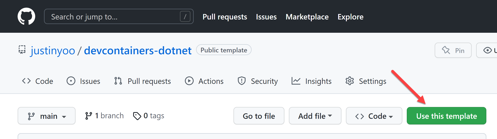

# devcontainers for .NET #

This is the template repository that contains the devcontainer settings for .NET app development.


## Getting Started ##

If you want to use this devcontainer settings, you can create a new repository with this template repository, by clicking the "*Use this template*" button.




## Options &ndash; `devcontainer.json` ##

### Base Image ###

By default, this devcontainer settings uses the base image of Ubuntu 22.04 LTS (jammy).

```jsonc
"build": {
  "dockerfile": "./Dockerfile",
  "context": ".",
  "args": {
    "VARIANT": "6.0-jammy"
  }
}
```

However, there is currently a bug on the [C# extension v1.25.0](https://marketplace.visualstudio.com/items?itemName=ms-dotnettools.csharp) for Razor support on Ubuntu 22.04 LTS (jammy). Therefore, if you need Razor support, build your devcontainer with Ubuntu 20.04 LTS (focal).

```jsonc
"build": {
  "dockerfile": "./Dockerfile",
  "context": ".",
  "args": {
    // Use this only if you need Razor support, until OmniSharp supports .NET 6 properly
    "VARIANT": "6.0-focal"
  }
}
```

### Features ###

1. If you want to install Azure CLI, uncomment the section under the `features` attribute.

    ```jsonc
    "features": {
      ...
      // Uncomment the below to install Azure CLI
      "ghcr.io/devcontainers/features/azure-cli:1": {
        "version": "latest"
      }
      ...
    },
    ```

1. If you want to install GitHub CLI, uncomment the section under the `features` attribute.

    ```jsonc
    "features": {
      ...
      // Uncomment the below to install GitHub CLI
      "ghcr.io/devcontainers/features/github-cli:1": {
        "version": "latest"
      }
      ...
    },
    ```

1. If you want to install node.js, uncomment the section under the `features` attribute.

    ```jsonc
    "features": {
      ...
      // Uncomment the below to install node.js
      "ghcr.io/devcontainers/features/node:1": {
        "version": "lts",
        "nodeGypDependencies": true,
        "nvmInstallPath": "/usr/local/share/nvm"
      }
      ...
    },
    ```

1. If you want to add more features, find [this repository: devcontainer features](https://github.com/devcontainers/features).


### Extensions ###

1. There are optional extensions that you can selectively install, under the `customizations.vscode.extensions` attribute. You can simply uncomment each line to enable or comment out one to disable.

    ```jsonc
    "customizations": {
      "vscode": {
        "extensions": [
          // Recommended extensions - GitHub
          "cschleiden.vscode-github-actions",
          "GitHub.vscode-pull-request-github",
  
          // Recommended extensions - Azure
          "ms-azuretools.vscode-bicep",
  
          // Recommended extensions - Collaboration
          "eamodio.gitlens",
          "EditorConfig.EditorConfig",
          "MS-vsliveshare.vsliveshare-pack",
          "streetsidesoftware.code-spell-checker",
  
          // Recommended extensions - .NET
          "Fudge.auto-using",
          "jongrant.csharpsortusings",
          "kreativ-software.csharpextensions",
  
          // Recommended extensions - Power Platform
          "microsoft-IsvExpTools.powerplatform-vscode",
  
          // Recommended extensions - Markdown
          "bierner.github-markdown-preview",
          "DavidAnson.vscode-markdownlint",
          "docsmsft.docs-linting",
          "johnpapa.read-time",
          "yzhang.markdown-all-in-one",

          ...
        ],
        ...
      }
    }
    ```

1. Alternatively, you can add as many extra extensions as you like, from [Visual Studio Code Marketplace](https://marketplace.visualstudio.com/VSCode).


### Settings ###

1. There are customisation options for your Codespaces settings, under the `customizations.vscode.settings` attribute. You can simply uncomment each item to enable or comment out one to disable.

    ```jsonc
    "customizations": {
      "vscode": {
        "settings": {
          // Uncomment if you want to use zsh as the default shell
          "terminal.integrated.defaultProfile.linux": "zsh",
          "terminal.integrated.profiles.linux": {
            "zsh": {
              "path": "/usr/bin/zsh"
            }
          },

          // Uncomment if you want to use CaskaydiaCove Nerd Font as the default terminal font
          "terminal.integrated.fontFamily": "CaskaydiaCove Nerd Font",

          // Uncomment if you want to disable the minimap view
          "editor.minimap.enabled": false,

          // Recommended settings for the explorer pane
          "explorer.sortOrder": "type",
          "explorer.fileNesting.enabled": true,
          "explorer.fileNesting.patterns": {
            "*.bicep": "${capture}.json",
            "*.razor": "${capture}.razor.css",
            "*.js": "${capture}.js.map"
          }
        }
      }
    }
    ```

1. If you want to do more granular configurations, refer to this page, [User and Workspace Settings](https://code.visualstudio.com/docs/getstarted/settings).


### Lifecycle ###

1. If you want to use `bash` as your main shell and want to run the shell script after the container is created:

    ```jsonc
    // Uncomment if you want to use bash in 'postCreateCommand' after the container is created
    "postCreateCommand": "/bin/bash ./.devcontainer/post-create.sh > ~/post-create.log",
    ```

1. If you want to use `zsh` as your main shell and want to run the shell script after the container is created:

    ```jsonc
    // Uncomment if you want to use zsh in 'postCreateCommand' after the container is created
    "postCreateCommand": "/usr/bin/zsh ./.devcontainer/post-create.sh > ~/post-create.log",
    ```


## Options &ndash; `post-create.sh` ##

1. If you want to install CaskaydiaCove Nerd Font, uncomment the section below.

    ```bash
    ## CaskaydiaCove Nerd Font
    # Uncomment the below to install the CaskaydiaCove Nerd Font
    mkdir $HOME/.local
    mkdir $HOME/.local/share
    mkdir $HOME/.local/share/fonts
    wget https://github.com/ryanoasis/nerd-fonts/releases/latest/download/CascadiaCode.zip
    unzip CascadiaCode.zip -d $HOME/.local/share/fonts
    rm CascadiaCode.zip
    ```

    > Use this option if you want to use oh-my-posh for PowerShell.

1. If you want to install Azure CLI extensions, uncomment the section below.

    ```bash
    ## AZURE CLI EXTENSIONS ##
    # Uncomment the below to install Azure CLI extensions
    extensions=$(az extension list-available --query "[].name" | jq -c -r '.[]')
    for extension in $extensions;
    do
        az extension add --name $extension
    done
    ```

    > Use this option with care because it will install **ALL** extensions at once.

1. If you want to install Azure Bicep CLI, uncomment the section below.

    ```bash
    ## AZURE BICEP CLI ##
    # Uncomment the below to install Azure Bicep CLI
    az bicep install
    ```

1. If you want to install Azure Functions Core Tools, uncomment the section below.

    ```bash
    ## AZURE FUNCTIONS CORE TOOLS ##
    # Uncomment the below to install Azure Functions Core Tools
    npm i -g azure-functions-core-tools@4 --unsafe-perm true
    ```

1. If you want to install Azure Static Web Apps CLI, uncomment the section below.

    ```bash
    ## AZURE STATIC WEB APPS CLI ##
    # Uncomment the below to install Azure Static Web Apps CLI
    npm install -g @azure/static-web-apps-cli
    ```

1. If you want to install Azure Dev CLI, uncomment the section below.

    ```bash
    ## AZURE DEV CLI ##
    # Uncomment the below to install Azure Dev CLI
    curl -fsSL https://aka.ms/install-azd.sh | bash
    ```

    > **DEPENDENCIES**: Make sure that you must get both Azure CLI and GitHub CLI installed beforehand.

1. If you want to install plugins and themes for oh-my-zsh without using your dotfiles, uncomment the section below.

    ```bash
    ## OH-MY-ZSH PLUGINS & THEMES (POWERLEVEL10K) ##
    # Uncomment the below to install oh-my-zsh plugins and themes (powerlevel10k) without dotfiles integration
    git clone https://github.com/zsh-users/zsh-completions.git $HOME/.oh-my-zsh/custom/plugins/zsh-completions
    git clone https://github.com/zsh-users/zsh-syntax-highlighting.git $HOME/.oh-my-zsh/custom/plugins/zsh-syntax-highlighting
    git clone https://github.com/zsh-users/zsh-autosuggestions.git $HOME/.oh-my-zsh/custom/plugins/zsh-autosuggestions

    git clone https://github.com/romkatv/powerlevel10k.git $HOME/.oh-my-zsh/custom/themes/powerlevel10k --depth=1
    ln -s $HOME/.oh-my-zsh/custom/themes/powerlevel10k/powerlevel10k.zsh-theme $HOME/.oh-my-zsh/custom/themes/powerlevel10k.zsh-theme
    ```

    > **DEPENDENCIES**: Make sure that you have already installed oh-my-zsh through the settings on `devcontainer.json`.

1. If you want to install oh-my-zsh configurations without using your dotfiles, uncomment the section below.

    ```bash
    ## OH-MY-ZSH - POWERLEVEL10K SETTINGS ##
    # Uncomment the below to update the oh-my-zsh settings without dotfiles integration
    curl https://raw.githubusercontent.com/justinyoo/devcontainers-dotnet/main/oh-my-zsh/.p10k-with-clock.zsh > $HOME/.p10k-with-clock.zsh
    curl https://raw.githubusercontent.com/justinyoo/devcontainers-dotnet/main/oh-my-zsh/.p10k-without-clock.zsh > $HOME/.p10k-without-clock.zsh
    curl https://raw.githubusercontent.com/justinyoo/devcontainers-dotnet/main/oh-my-zsh/switch-p10k-clock.sh > $HOME/switch-p10k-clock.sh
    chmod +x ~/switch-p10k-clock.sh

    cp $HOME/.p10k-with-clock.zsh $HOME/.p10k.zsh
    cp $HOME/.zshrc $HOME/.zshrc.bak

    echo "$(cat $HOME/.zshrc)" | awk '{gsub(/ZSH_THEME=\"codespaces\"/, "ZSH_THEME=\"powerlevel10k\"")}1' > $HOME/.zshrc.replaced && mv $HOME/.zshrc.replaced $HOME/.zshrc
    echo "$(cat $HOME/.zshrc)" | awk '{gsub(/plugins=\(git\)/, "plugins=(git zsh-completions zsh-syntax-highlighting zsh-autosuggestions)")}1' > $HOME/.zshrc.replaced && mv $HOME/.zshrc.replaced $HOME/.zshrc
    echo "
    # To customize prompt, run 'p10k configure' or edit ~/.p10k.zsh.
    [[ ! -f ~/.p10k.zsh ]] || source ~/.p10k.zsh
    " >> $HOME/.zshrc
    ```

    > **DEPENDENCIES**: Make sure that you uncommend the oh-my-zsh plugins and themes section before using this section.

    > If you want to switch the `powerlevel10k` configuration with clock or without clock, run the following shell script:
    > 
    > ```bash
    > # Disable clock
    > ~/switch-p10k-clock.sh
    > 
    > # Enable clock
    > ~/switch-p10k-clock.sh -c
    > ```

1. If you want to install oh-my-posh for PowerShell, uncomment the section below

    ```bash
    ## OH-MY-POSH ##
    # Uncomment the below to install oh-my-posh
    sudo wget https://github.com/JanDeDobbeleer/oh-my-posh/releases/latest/download/posh-linux-amd64 -O /usr/local/bin/oh-my-posh
    sudo chmod +x /usr/local/bin/oh-my-posh
    ```

1. If you want to install oh-my-posh configurations without using your dotfiles, uncomment the section below.

    ```bash
    ## OH-MY-POSH - POWERLEVEL10K SETTINGS ##
    # Uncomment the below to update the oh-my-posh settings without dotfiles integration
    curl https://raw.githubusercontent.com/justinyoo/devcontainers-dotnet/main/oh-my-posh/p10k-with-clock.omp.json > $HOME/p10k-with-clock.omp.json
    curl https://raw.githubusercontent.com/justinyoo/devcontainers-dotnet/main/oh-my-posh/p10k-without-clock.omp.json > $HOME/p10k-without-clock.omp.json
    curl https://raw.githubusercontent.com/justinyoo/devcontainers-dotnet/main/oh-my-posh/switch-p10k-clock.ps1 > $HOME/switch-p10k-clock.ps1

    mkdir $HOME/.config/powershell
    curl https://raw.githubusercontent.com/justinyoo/devcontainers-dotnet/main/oh-my-posh/Microsoft.PowerShell_profile.ps1 > $HOME/.config/powershell/Microsoft.PowerShell_profile.ps1

    cp $HOME/p10k-with-clock.omp.json $HOME/p10k.omp.json
    ```

    > **DEPENDENCIES**: Make sure that you uncommend the oh-my-posh installation section before using this section.

    > If you want to switch the `powerlevel10k` configuration with clock or without clock, run the following shell script:
    > 
    > ```powershell
    > # Disable clock
    > ~/switch-p10k-clock.ps1
    > 
    > # Enable clock
    > ~/switch-p10k-clock.ps1 -WithClock
    > ```
